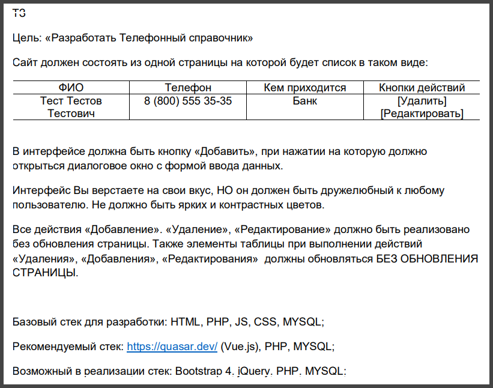

# Desription

[The "Phonebook"](https://marre-86.github.io/phonebook-production/#/) is a simple Single Page Application (SPA) with a REST API-based backend. It was developed by [Artem Pokhiliuk](https://www.linkedin.com/in/artem-pokhiliuk/) as a test assignment using the [Quasar framework](https://quasar.dev/) for the frontend and the [Laravel framework](https://laravel.com/) for the backend.

The task the project was developed according to:

The source code repository for the backend of the project is available [here](https://github.com/Marre-86/phonebook-back).

List of API endpoints:

**Server URL:** https://phonebook-back-production.up.railway.app/api:

- **GET /contacts** - returns a list of contacts in the database.
- **POST /contacts** - adds a new contact.
- **PUT /contacts/:id** - updates the contact with the specified id.
- **DELETE /contacts/:id** - deletes the contact with the specified id.

The initial implementation of the frontend was carried out independently from the backend and utilized [Pinia store for Vue](https://pinia.vuejs.org/). This version of the project has been captured and can be accessed in [this commit](https://github.com/Marre-86/phonebook-front/commit/43466e3c63bc2115fc7f10c265dc1a026e3c953c).